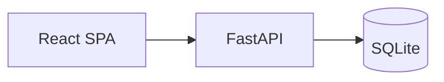

# Architecture

Digital Game Marketplace is a full-stack web application for browsing, purchasing, and managing digital games.

## Stack

| Layer | Technology |
|-------|------------|
| API | FastAPI, SQLAlchemy, Pydantic |
| Database | SQLite (development) |
| Auth | JWT (OAuth2 password flow) |
| Frontend | React 19, Vite, Tailwind CSS |
| Client HTTP | Axios |

## High-level flow

## Backend layout

- `backend/main.py` — app entry, CORS, router registration
- `backend/models.py` — SQLAlchemy models (User, Game, Order, Cart, Review, Genre)
- `backend/schemas.py` — Pydantic request/response models
- `backend/auth_utils.py` — JWT, role guards, active-user checks
- `backend/routers/` — route modules (`auth`, `games`, `cart`, `orders`, `admin`, …)

## Roles

- **USER** — browse, cart, purchase, library, reviews
- **DEVELOPER** — publish and manage own games
- **ADMIN** — approve games, moderate users, platform stats

## Data model (core)

- `User` — accounts with role and optional developer profile
- `Game` — catalog item with status workflow (`PENDING` → `APPROVED` / `REJECTED` / `SUSPENDED`)
- `Order` / `OrderItem` — purchase history and ownership
- `CartItem` — pre-checkout basket
- `Review` — per-game user reviews
- `Genre` — many-to-many with games

## Security notes

- Passwords hashed with bcrypt via Passlib
- Protected routes use `get_current_active_user` and role-specific dependencies
- Banned users are blocked at the auth dependency layer

## Diagrams

Sequence diagrams for main flows live in [diagrams/](diagrams/).
